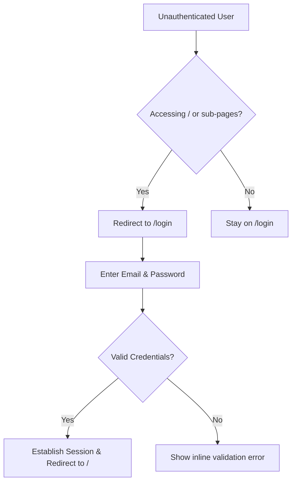
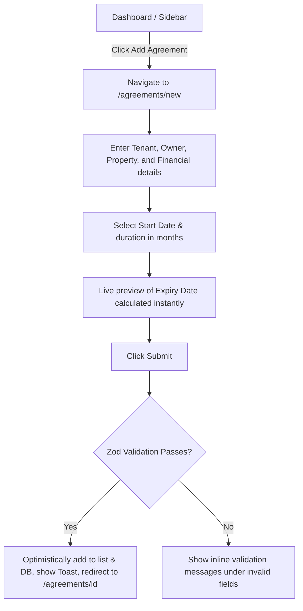

# Application Flow & Routing Documentation

This document describes the application routing structure, navigation patterns, and user journey flows for **Samarth Services**.

---

## 1. App Router Structure (Next.js)

The application uses the Next.js App Router. The directory structure is organized as follows:

```
src/app/
├── (auth)/
│   ├── login/
│   │   └── page.tsx           # Login Screen (Email & Password)
│   └── layout.tsx             # Centered layout for auth pages
├── (dashboard)/
│   ├── layout.tsx             # Shell layout: Left Sidebar (Desktop) / Bottom Nav (Mobile)
│   ├── page.tsx               # Dashboard Home (Charts, Stats, Recent Agreements)
│   ├── agreements/
│   │   ├── page.tsx           # Agreements List (Search, Filter, Export Actions)
│   │   ├── new/
│   │   │   └── page.tsx       # Create Agreement Form
│   │   └── [id]/
│   │       ├── page.tsx       # Detail / Customer View (Timeline, Logs)
│   │       └── edit/
│   │           └── page.tsx   # Edit Agreement Form
│   ├── reminders/
│   │   └── page.tsx           # Reminders Queue (Bucketed 30-day/7-day/Expiry alerts)
│   ├── greetings/
│   │   └── page.tsx           # Festival Greetings Broadcast Composer
│   └── settings/
│       └── page.tsx           # Agency Profile Settings
```

---

## 2. Navigation Architecture

### 2.1 Sidebar Navigation (Desktop & Tablet)
- **Position**: Left sidebar, persistent across all pages inside the `(dashboard)` route group.
- **Controls**:
  - Logo / Agency Brand header.
  - Nav links with Lucide icons: Dashboard (`LayoutDashboard`), Agreements (`FileText`), Reminders (`Bell`), Greetings (`Send`), Settings (`Settings`).
  - Active links highlighted in Brand Yellow (`#F5B301`) or dark fill depending on the mode, with clear visual indicator.
  - Quick action: "Add Agreement" button (`Plus`) pinned at the top or bottom of the sidebar.
  - Logout action at the bottom.

### 2.2 Mobile Navigation (Mobile Viewports ≤ 768px)
- **Position**: Bottom navigation bar or top hamburger menu collapsing into a full-height drawer.
- **Links**: Condensed to core features (Dashboard, Agreements, Reminders, Greetings).

---

## 3. User Flows & Journeys

### 3.1 Authentication Flow


### 3.2 Agreement CRUD Flow


### 3.3 Reminder Trigger Flow
1. **Navigate**: User clicks "Reminders" in the navigation sidebar, routing to `/reminders`.
2. **Review**: The system displays cards/lists of agreements requiring reminders today. Three columns/tabs group them: `30-Day Alert`, `7-Day Alert`, `Expiry Day Alert`.
3. **Trigger**: User clicks "Send via WhatsApp" or "Send via SMS" next to a tenant or owner's contact card.
4. **Log & Feed**:
   - The UI immediately replaces the button with a loading spinner or disable state (optimistic lock).
   - An API handler writes a row to the `ReminderLog` database table.
   - A success toast appears: "Simulated WhatsApp message logged for [Tenant Name]".
   - The entry is immediately updated/marked as sent for the day.

### 3.4 Broadcast Festival Greetings Flow
1. **Navigate**: User routes to `/greetings`.
2. **Configure**:
   - **Occasion**: User selects from a dropdown (e.g., Diwali, Ganesh Chaturthi, Holi, New Year, Custom).
   - **Channel**: Selects WhatsApp or SMS.
   - **Recipient Filter**: Selects "All Contacts", "Active Agreements Only", or "Custom Selection" (which reveals a multi-select search list of tenants/owners).
   - **Message Template**: Auto-populates standard greetings text based on the occasion (fully editable by the user).
3. **Send**: Click "Broadcast Greeting".
4. **Result**: Shows success alert toast ("Simulated message sent to X contacts") and creates audit entries in `GreetingLog`.

### 3.5 Filtering and Deep Linking Flow
1. User searches for "John" in the search box on `/agreements`.
2. The URL changes dynamically to `/agreements?search=John` (debounced by 300ms).
3. User selects the "Expiring Soon" filter tab.
4. The URL updates to `/agreements?search=John&status=expiring_soon`.
5. User copies the URL and shares it with a colleague.
6. The colleague logs in and is redirected straight to the pre-filtered search results page.
