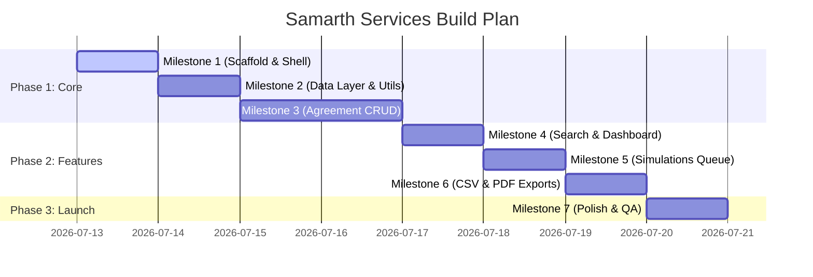

# Implementation Plan & Milestones Roadmap

This document outlines the step-by-step development sequence, technical tasks, and validation checkpoints for **Samarth Services**.

---

## 1. Development Sequence

We will execute the project in 7 distinct, sequential milestones.

---

## 2. Milestones & Task Breakdown

### Milestone 1: Project Setup & Shell Layout
- [ ] Scaffold Next.js 14+ app using `npx create-next-app` in the root directory.
- [ ] Set up Tailwind CSS configuration with specified hex-color tokens.
- [ ] Set up Google Font `Public Sans` locally using `next/font/google`.
- [ ] Implement responsive shell layouts (`Sidebar.tsx` and `Header.tsx`) supporting mobile/desktop.
- [ ] Install dependency libraries: `lucide-react`, `date-fns`, `recharts`, `react-hook-form`, `@hookform/resolvers`, `zod`, `papaparse`, `jspdf`, `jspdf-autotable`.

### Milestone 2: Data Access Layer & Helper Utils
- [ ] Initialize Prisma. Configure the local SQLite connection (`dev.db`).
- [ ] Create the Prisma Schema models for `Agreement`, `ReminderLog`, `GreetingLog`, and `User`.
- [ ] Run initial migrations (`npx prisma migrate dev`).
- [ ] Code core Date utils (`src/lib/expiry.ts`) to handle calendar months addition, expiry dates, and dynamic agreement statuses.
- [ ] Write a test script in `src/scratch/test-dates.ts` to verify the edge cases (month-ends, leap years).

### Milestone 3: Agreement CRUD (Core Engine)
- [ ] Set up Zod forms schema (`src/lib/validation.ts`) for agreement fields.
- [ ] Implement user session mock / lightweight middleware login auth (`/login`).
- [ ] Build **Add Agreement Form** with real-time preview of the calculated expiration date.
- [ ] Build **Edit Agreement Form** that updates fields and updates dates on save.
- [ ] Build **Detail View** screen featuring contact timelines, status badges, and related reminder history lists.
- [ ] Build **Delete Agreement** with a dialog confirmation modal.

### Milestone 4: Search, Filters & Dashboard
- [ ] Build **Dashboard View** showing live metric aggregations (counts derived via prisma database queries).
- [ ] Integrate **Recharts** to draw a 90-day expiry forecast chart on the dashboard.
- [ ] Implement **Agreements List Table** (Desktop) and **Agreements List Cards** (Mobile).
- [ ] Set up URL search queries sync for search text (debounced) and status filter chips.

### Milestone 5: Simulated Reminder Queue & Greetings Broadcasts
- [ ] Build **Reminders Queue** view with filtered list tabs (30-day, 7-day, expiry).
- [ ] Implement SMS / WhatsApp simulated action buttons. When clicked, write logs to the database (`ReminderLog`) and show confirmation toasts.
- [ ] Render historical reminder logs inside the **Agreement Detail View** timeline.
- [ ] Build **Festival Greetings composer** with standard text templates and custom select multi-filtering.

### Milestone 6: Client-Side Data Exports
- [ ] Implement filtered grid CSV output using `papaparse` from the list view.
- [ ] Implement list view grid PDF report downloads using `jspdf` and `jspdf-autotable`.
- [ ] Create a formatted layout download for **Single Agreement Summaries** inside the Detail page.

### Milestone 7: Polish & QA Pass
- [ ] Custom empty list screen components with Lucide icons (no emojis, plain text helper links).
- [ ] Add Tailwind transition styles and skeleton frames during fetch loading states.
- [ ] Review color contrast for WCAG AA compliance (ensure text on yellow buttons is readable dark gray/black).
- [ ] Audit accessibility tags (semantic tags, keyboard focus rings, Aria tags).
- [ ] Perform Leap year boundary and extreme data size QA validation.
