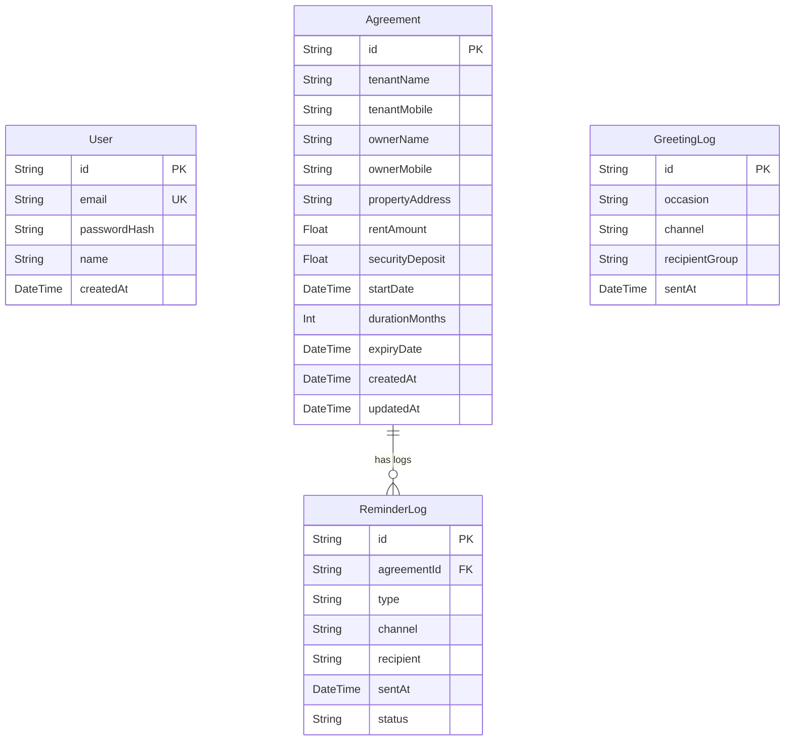

# Database Schema Documentation

This document defines the relational database model for **Samarth Services**. It provides details for both **Prisma + SQLite** (local development) and **Supabase (PostgreSQL)**.

---

## 1. Relational Entity Relationship Diagram



---

## 2. Prisma Schema (`schema.prisma`)

```prisma
datasource db {
  provider = "sqlite" // Can be switched to "postgresql" for Supabase/PostgreSQL
  url      = env("DATABASE_URL")
}

generator client {
  provider = "prisma-client-js"
}

model User {
  id           String   @id @default(uuid())
  email        String   @unique
  passwordHash String
  name         String
  createdAt    DateTime @default(now())
}

model Agreement {
  id              String        @id @default(uuid())
  tenantName      String        @map("tenant_name")
  tenantMobile    String        @map("tenant_mobile")
  ownerName       String        @map("owner_name")
  ownerMobile     String        @map("owner_mobile")
  propertyAddress String        @map("property_address")
  rentAmount      Float         @map("rent_amount")
  securityDeposit Float         @map("security_deposit")
  startDate       DateTime      @map("start_date")
  durationMonths  Int           @default(11) @map("duration_months")
  expiryDate      DateTime      @map("expiry_date")
  createdAt       DateTime      @default(now()) @map("created_at")
  updatedAt       DateTime      @updatedAt @map("updated_at")
  reminders       ReminderLog[]

  @@index([expiryDate])
  @@map("agreements")
}

model ReminderLog {
  id          String    @id @default(uuid())
  agreementId String    @map("agreement_id")
  agreement   Agreement @relation(fields: [agreementId], references: [id], onDelete: Cascade)
  type        String    // "30_day" | "7_day" | "on_expiry"
  channel     String    // "whatsapp" | "sms"
  recipient   String    // "tenant" | "owner"
  sentAt      DateTime  @default(now()) @map("sent_at")
  status      String    // "simulated_sent"

  @@index([agreementId])
  @@map("reminder_logs")
}

model GreetingLog {
  id             String   @id @default(uuid())
  occasion       String
  channel        String   // "whatsapp" | "sms"
  recipientGroup String   @map("recipient_group") // "all" | "active_only" | "custom_selection"
  sentAt         DateTime @default(now()) @map("sent_at")

  @@map("greeting_logs")
}
```

---

## 3. PostgreSQL / Supabase SQL DDL (Equivalent)

If deploying to Supabase, run the following SQL schema inside the Supabase SQL Editor:

```sql
-- Enable UUID extension
CREATE EXTENSION IF NOT EXISTS "uuid-ossp";

-- Users Table
CREATE TABLE users (
    id UUID PRIMARY KEY DEFAULT uuid_generate_v4(),
    email VARCHAR(255) UNIQUE NOT NULL,
    password_hash VARCHAR(255) NOT NULL,
    name VARCHAR(255) NOT NULL,
    created_at TIMESTAMP WITH TIME ZONE DEFAULT CURRENT_TIMESTAMP NOT NULL
);

-- Agreements Table
CREATE TABLE agreements (
    id UUID PRIMARY KEY DEFAULT uuid_generate_v4(),
    tenant_name VARCHAR(255) NOT NULL,
    tenant_mobile VARCHAR(15) NOT NULL,
    owner_name VARCHAR(255) NOT NULL,
    owner_mobile VARCHAR(15) NOT NULL,
    property_address TEXT NOT NULL,
    rent_amount NUMERIC(12, 2) NOT NULL,
    security_deposit NUMERIC(12, 2) NOT NULL,
    start_date DATE NOT NULL,
    duration_months INT DEFAULT 11 NOT NULL,
    expiry_date DATE NOT NULL,
    created_at TIMESTAMP WITH TIME ZONE DEFAULT CURRENT_TIMESTAMP NOT NULL,
    updated_at TIMESTAMP WITH TIME ZONE DEFAULT CURRENT_TIMESTAMP NOT NULL
);

-- Index for searching expirations efficiently
CREATE INDEX idx_agreements_expiry ON agreements (expiry_date);

-- Reminder Logs Table
CREATE TABLE reminder_logs (
    id UUID PRIMARY KEY DEFAULT uuid_generate_v4(),
    agreement_id UUID REFERENCES agreements(id) ON DELETE CASCADE NOT NULL,
    type VARCHAR(50) NOT NULL, -- '30_day', '7_day', 'on_expiry'
    channel VARCHAR(20) NOT NULL, -- 'whatsapp', 'sms'
    recipient VARCHAR(20) NOT NULL, -- 'tenant', 'owner'
    sent_at TIMESTAMP WITH TIME ZONE DEFAULT CURRENT_TIMESTAMP NOT NULL,
    status VARCHAR(50) NOT NULL -- 'simulated_sent'
);

CREATE INDEX idx_reminder_logs_agreement ON reminder_logs (agreement_id);

-- Greeting Logs Table
CREATE TABLE greeting_logs (
    id UUID PRIMARY KEY DEFAULT uuid_generate_v4(),
    occasion VARCHAR(255) NOT NULL,
    channel VARCHAR(20) NOT NULL,
    recipient_group VARCHAR(50) NOT NULL,
    sent_at TIMESTAMP WITH TIME ZONE DEFAULT CURRENT_TIMESTAMP NOT NULL
);
```

---

## 4. Key Calculation Formulas in Code

### 4.1 Expiry Date Calculation
When an agreement is saved or updated:
$$\text{Expiry Date} = \text{startDate} + \text{durationMonths} - 1\text{ day}$$
*Example: start date `2026-01-15` with duration `11 months` resolves to `2026-12-14`.*

### 4.2 Derived Agreement Status
Evaluated on every query to ensure accuracy relative to the current server date:
- **Expired**: $\text{today} > \text{expiryDate}$
- **Expiring Soon**: $\text{expiryDate} - \text{today} \le 30 \text{ days} \text{ and } \text{today} \le \text{expiryDate}$
- **Active**: $\text{expiryDate} - \text{today} > 30 \text{ days}$
